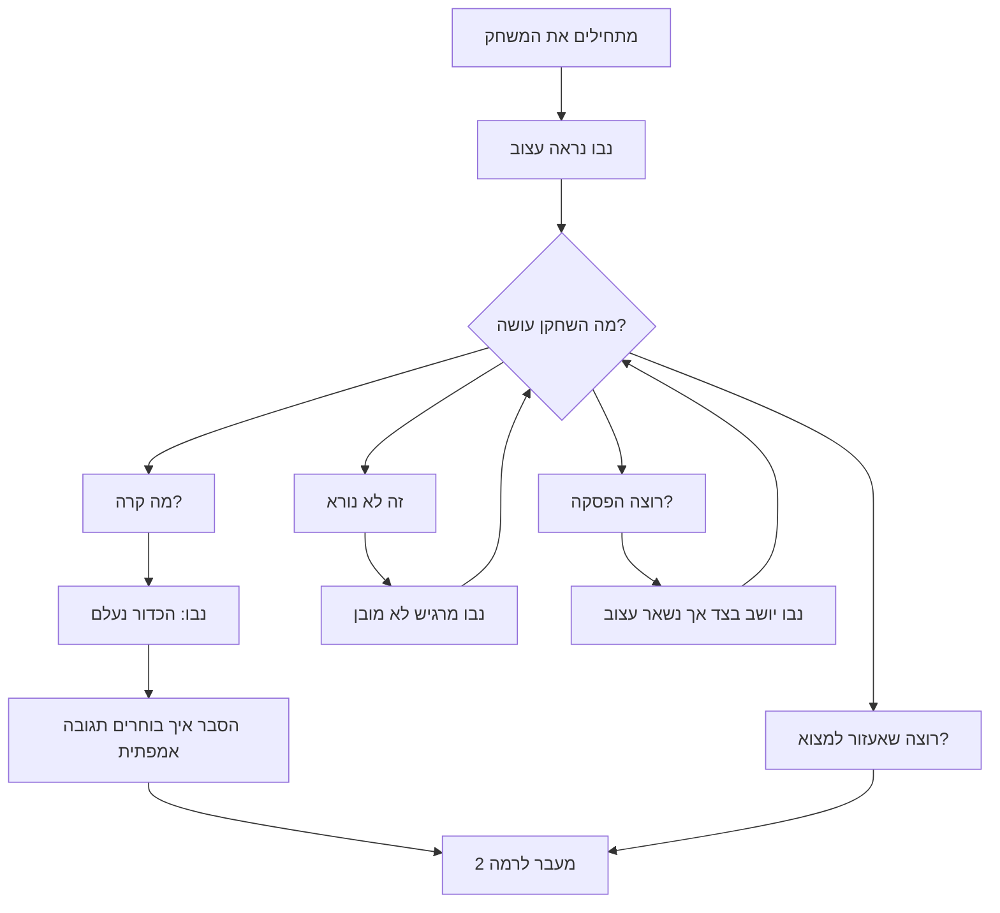
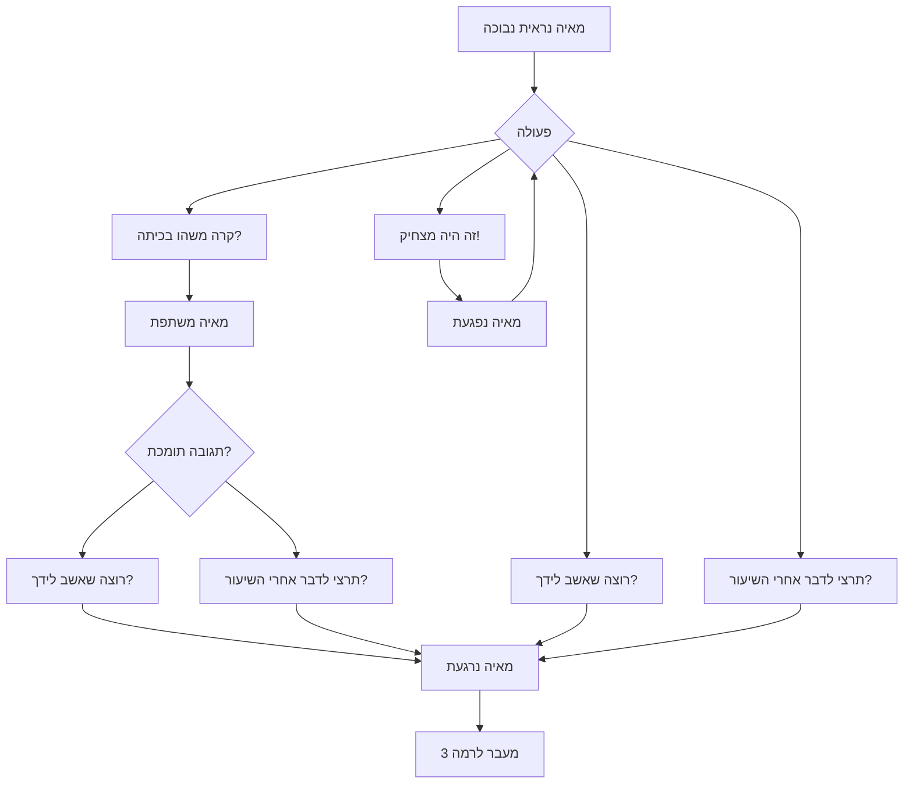
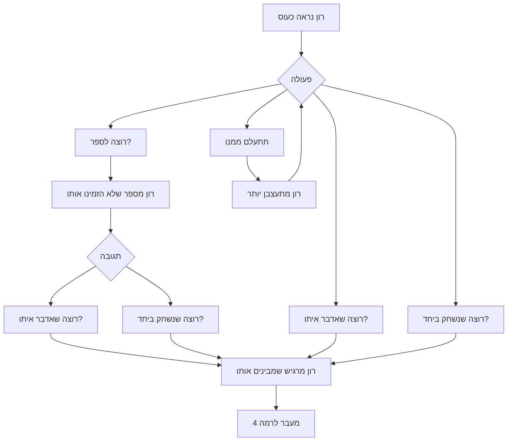
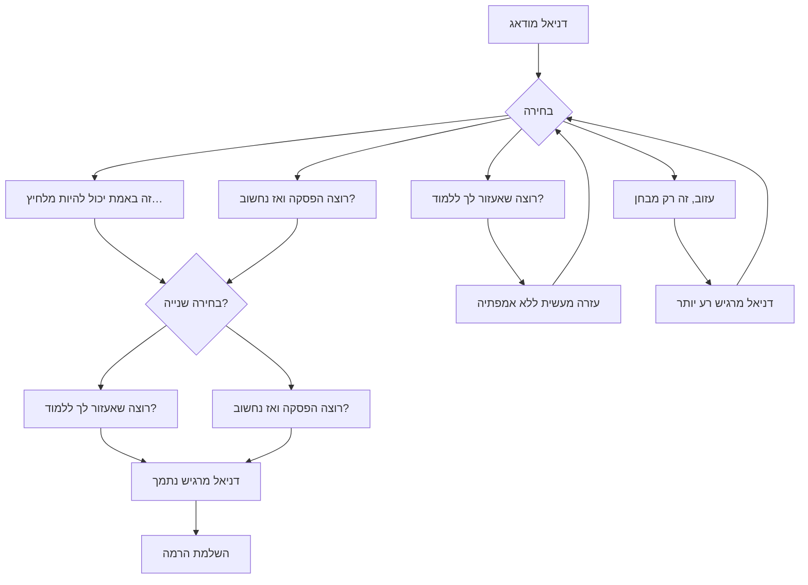

# תכנון רמות למשחק *לבון*

המשחק עוסק בזיהוי רגשות, אמפתיה ובחירה של תגובה מתאימה לדמויות שונות. כל רמה מציגה דמות, מצב רגשי, מידע נלווה ואפשרויות תגובה.

---

# רמה 1 – מדריך (Tutorial)

### מטרות חינוכיות

* להכיר את ממשק המשחק
* לזהות רגש בסיסי (שמחה / עצב)
* להבין בפעם הראשונה שהבחירה משפיעה על התגובה של הדמות

### תיאור הסצנה

*דמות:* ילד בשם נבו
*רגש:* עצוב
*רקע:* בגן המשחקים, הכדור שלו התגלגל הצידה

### פעולות אפשריות

1. **“מה קרה?”** – נבו מספר שאיבד את הכדור.
2. **“רוצה שאעזור למצוא?”** – משמח אותו.
3. **“זה לא נורא.”** – גורם לנבו להרגיש שלא מבינים אותו.
4. **“רוצה הפסקה?”** – נבו בוחר לשבת רגע בצד.

### מעבר רמה

המשתמש צריך לבחור *תגובה אמפתית אחת* (1 או 2) כדי להתקדם.

### תרשים זרימה – רמה 1

---

# רמה 2 – קלה

### מטרות חינוכיות

* לשאול שאלות מתקדמות על הרגש
* להבין סיטואציה חברתית פשוטה

### תיאור הסצנה

*דמות:* מאיה
*רגש:* מתביישת
*רקע:* המאיה שרה בטעות בקול רם בכיתה וכולם הסתכלו עליה

### פעולות אפשריות

1. **“קרה משהו בכיתה?”** – מאיה מספרת.
2. **“זה היה מצחיק!”** – מאיה נפגעת.
3. **“רוצה שאשב לידך?”** – משפר את הרגשתה.
4. **“תרצי לדבר אחרי השיעור?”** – מאיה מרגישה בטוחה יותר.

### מעבר רמה

שילוב של *שאלה* + *תגובה תומכת*.

### תרשים זרימה – רמה 2

---

# רמה 3 – בינונית

### מטרות חינוכיות

* להבין רגשות מורכבים יותר (כעס + פגיעה)
* לקבל מידע חלקי ולהשלים פרטים דרך שאלות
* לבחור תגובות רגשיות ומעשיות

### תיאור הסצנה

*דמות:* רון
*רגש:* כועס ומאוכזב
*רקע:* חברו לא הזמין אותו לשחק

### פעולות אפשריות

1. **“אתה נראה כועס… רוצה לספר?”** – פותח שיחה.
2. **“אז פשוט תתעלם ממנו.”** – לא עוזר.
3. **“רוצה שאדבר איתו?”** – פתרון אפשרי.
4. **“רוצה שנשחק ביחד?”** – מסיח ומרגיע.

### מעבר רמה

המשתמש צריך להבין את המקור לכעס ולבחור פתרון חיובי.

### תרשים זרימה – רמה 3

---

# רמה 4 – קשה

### מטרות חינוכיות

* דילמות אמיתיות ללא תשובה אחת “נכונה”
* שילוב רגשות מרובים: פחד, דאגה, בלבול
* הבנה שהבחירה משפיעה על התפתחות הסיפור

### תיאור הסצנה

*דמות:* דניאל
*רגש:* מודאג ופוחד
*רקע:* מחר יש לו מבחן גדול והוא מרגיש לא מוכן

### פעולות אפשריות

1. **“רוצה שאעזור לך ללמוד?”** – תמיכה מעשית.
2. **“זה באמת יכול להיות מלחיץ…”** – אמפתיה מלאה.
3. **“עזוב, זה רק מבחן.”** – דניאל מרגיש חוסר הבנה.
4. **“רוצה הפסקה קטנה ואז נחשוב יחד?”** – ויסות רגשי.

### מעבר רמה

המשתמש צריך לבחור *שתי תגובות*: אמפתיה + פעולה.

### תרשים זרימה – רמה 4

---
